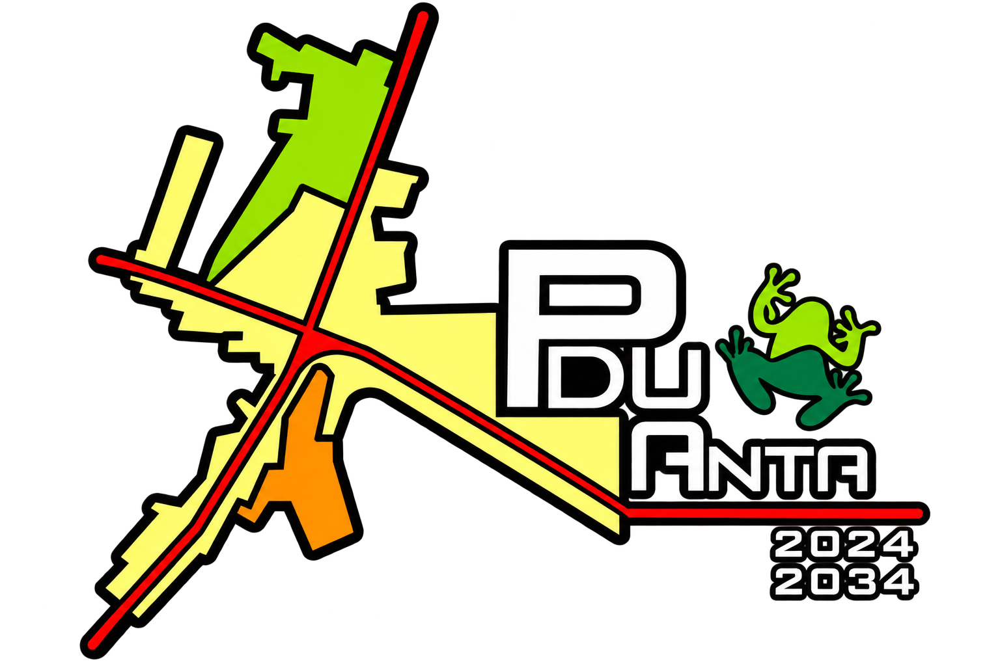

```{r setup, include=FALSE}
knitr::opts_chunk$set(echo = FALSE)
```

<style>
  :root {
    --verde-inst: #008800;
    --verde-pdu: #98C838;
    --verde-oscuro: #006633;
    --dorado-inst: #B88808;
    --amarillo-pdu: #F8F888;
    --naranja-alerta: #F89808;
    --rojo-pdu: #D80808;
    --carbon-texto: #202020;
    --gris-claro: #F2F3EF;
    --crema-inst: #FFF7D6;
  }
  
  body { font-family: 'Segoe UI', Arial, sans-serif; color: var(--carbon-texto); line-height: 1.5; }
  
  .header-box { 
    background: linear-gradient(135deg, var(--verde-oscuro), var(--verde-inst)); 
    color: white; 
    padding: 18px 24px; 
    border-radius: 8px; 
    margin-bottom: 20px; 
    border-bottom: 4px solid var(--dorado-inst);
  }
  
  .header-logos {
    display: flex;
    justify-content: space-between;
    align-items: center;
    margin-bottom: 12px;
    background: white;
    padding: 8px 16px;
    border-radius: 6px;
  }
  
  .section-title { 
    color: var(--verde-oscuro); 
    border-bottom: 2px solid var(--verde-pdu); 
    padding-bottom: 5px; 
    margin-top: 22px; 
    font-weight: 700;
    font-size: 1.15em;
  }
  
  .table-custom { width: 100%; border-collapse: collapse; margin-top: 8px; margin-bottom: 18px; font-size: 0.93em; }
  .table-custom th { background-color: var(--gris-claro); color: var(--verde-oscuro); padding: 8px 12px; border: 1px solid #d5dbdb; width: 34%; text-align: left; }
  .table-custom td { padding: 8px 12px; border: 1px solid #d5dbdb; }
  
  .alert-warning { background-color: var(--crema-inst); border-left: 5px solid var(--dorado-inst); color: #78350f; padding: 10px 14px; border-radius: 4px; margin-bottom: 10px; }
  .alert-danger { background-color: #fef2f2; border-left: 5px solid var(--rojo-pdu); color: #991b1b; padding: 10px 14px; border-radius: 4px; margin-bottom: 10px; }
  .alert-success { background-color: #f0fdf4; border-left: 5px solid var(--verde-inst); color: #166534; padding: 10px 14px; border-radius: 4px; margin-bottom: 10px; }
  
  .badge-vial {
    background: var(--dorado-inst);
    color: white;
    padding: 2px 8px;
    border-radius: 4px;
    font-weight: bold;
  }
  
  .project-meta-box {
    background-color: var(--gris-claro);
    border: 1px solid #dcdcdc;
    border-radius: 6px;
    padding: 10px 14px;
    font-size: 0.85em;
    margin-bottom: 15px;
  }
</style>

<div class="header-box">
  <table style="width:100%; color:white; border:none;">
    <tr>
      <td style="width:70px; vertical-align:middle; border:none;">
        
      </td>
      <td style="vertical-align:middle; padding-left:15px; border:none;">
        <h3 style="margin:0; font-weight:bold; color:white; letter-spacing:0.5px;">MUNICIPALIDAD PROVINCIAL DE ANTA</h3>
        <h5 style="margin:4px 0 0 0; color:#F8F888; font-weight:600;">SISTEMA DE INFORMACIÓN TERRITORIAL - GEOVISOR PDU</h5>
      </td>
      <td style="width:90px; text-align:right; vertical-align:middle; border:none;">
        
      </td>
    </tr>
  </table>
</div>

<div class="project-meta-box">
  <strong>Proyecto:</strong> <em>«Mejoramiento de los Servicios de Gestión Territorial y Desarrollo Urbano Sostenible, del distrito de Anta, provincia de Anta, departamento del Cusco»</em><br>
  <strong>Instrumento de Gestión:</strong> <em>PLAN DE DESARROLLO URBANO DE ANTA 2024 - 2034</em>
</div>

<h4 class="section-title">1. DATOS DE LOCALIZACIÓN ESPACIAL</h4>

<table class="table-custom">
  <tr>
    <th>Distrito Administrativo:</th>
    <td><strong>`r params$distrito`</strong> (Provincia de Anta, Cusco)</td>
  </tr>
  <tr>
    <th>¿Dentro del Ámbito Reglamentado PDU?</th>
    <td>`r ifelse(params$ambito_pdu == "SÍ", '<span style="color:#008800; font-weight:bold;">SÍ (Área Reglamentada PDU Anta)</span>', '<span style="color:#D80808; font-weight:bold;">NO (Fuera del Ámbito PDU)</span>')`</td>
  </tr>
  <tr>
    <th>Coordenadas Geográficas (WGS84):</th>
    <td>`r params$coords_geo`</td>
  </tr>
  <tr>
    <th>Coordenadas Proyectadas (UTM Zona 18S):</th>
    <td>`r params$coords_utm`</td>
  </tr>
</table>

<h4 class="section-title">2. CLASIFICACIÓN DE ZONIFICACIÓN Y USO DE SUELO</h4>

<table class="table-custom">
  <tr>
    <th>Código de Zona:</th>
    <td><strong style="color:#006633; font-size:1.1em;">`r params$cod_zona`</strong></td>
  </tr>
  <tr>
    <th>Subzona / Tipología:</th>
    <td><strong>`r params$cod_s_zona`</strong> - `r params$nombre_zona`</td>
  </tr>
</table>

<h4 class="section-title">3. CONDICIONANTES Y RESTRICCIONES DE INFRAESTRUCTURA Y RIESGO</h4>

```{r, results='asis'}
if (params$servidumbre_at == "SÍ") {
  cat('<div class="alert-danger"><strong>⚠️ ALERTA DE SERVIDUMBRE ELÉCTRICA:</strong> El punto consultado se ubica dentro de la faja de servidumbre de Líneas de Transmisión de Alta Tensión (Código Nacional de Electricidad / ZRE-NU-RE). Se prohíben edificaciones habitacionales y presencia masiva.</div>')
}
if (params$servidumbre_ffcc == "SÍ") {
  cat('<div class="alert-warning"><strong>⚠️ ALERTA DE DERECHO DE VÍA FERROVIARIO:</strong> El predio se encuentra en la faja de seguridad o zona de influencia del Ferrocarril Trasandino (D.S. 032-2005-MTC). Toda obra requiere autorización sectorial previa.</div>')
}
if (params$servidumbre_at != "SÍ" && params$servidumbre_ffcc != "SÍ") {
  cat('<div class="alert-success">✓ No se registran afectaciones directas de servidumbres de alta tensión ni faja ferroviaria en el punto consultado.</div>')
}
```

<h4 class="section-title">4. SISTEMA VIAL PROPUESTO Y SECCIÓN VIAL NORMATIVA</h4>

<table class="table-custom">
  <tr>
    <th>Jerarquía del Sistema Vial:</th>
    <td><strong>`r params$sistema_vial`</strong></td>
  </tr>
  <tr>
    <th>Código de Vía Propuesta:</th>
    <td><strong>`r params$cod_via_pr`</strong></td>
  </tr>
  <tr>
    <th>Sección Vial Normativa (SV):</th>
    <td><span class="badge-vial">`r params$seccion_vial`</span></td>
  </tr>
</table>

<h4 class="section-title">5. PARÁMETROS URBANÍSTICOS Y EDIFICATORIOS NORMATIVOS</h4>

<table class="table-custom">
  <tr>
    <th>Densidad Neta Máxima:</th>
    <td>`r params$densidad`</td>
  </tr>
  <tr>
    <th>Área Mínima de Lote Normativo:</th>
    <td>`r params$lote_min`</td>
  </tr>
  <tr>
    <th>Frente Mínimo de Lote Normativo:</th>
    <td>`r params$frente_min`</td>
  </tr>
  <tr>
    <th>Altura Máxima de Edificación:</th>
    <td><strong>`r params$altura_max`</strong></td>
  </tr>
  <tr>
    <th>Área Libre Mínima (%):</th>
    <td>`r params$area_libre`</td>
  </tr>
  <tr>
    <th>Coeficiente de Edificación:</th>
    <td>`r params$coef_edif`</td>
  </tr>
  <tr>
    <th>Retiro Frontal Obligatorio:</th>
    <td>`r params$retiro_front`</td>
  </tr>
  <tr>
    <th>Usos Permitidos y Compatibles:</th>
    <td>`r params$usos`</td>
  </tr>
</table>

<hr style="border-top: 1px solid #d5dbdb; margin-top:25px;">
<p style="font-size:0.8em; color:#555; text-align:center;">
  <em>Este documento es un reporte informativo digital expedido por el Geovisor del Plan de Desarrollo Urbano de Anta (PDU 2024-2034). La validez legal definitiva de licencias y proyectos de habilitación urbana y edificación se rige por las ordenanzas provinciales vigentes y la normativa técnica del Reglamento Nacional de Edificaciones (RNE).</em>
</p>
